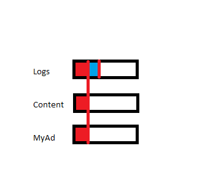

# The picking problem #

*"We want to show to a visit 4 recommended articles for a particular article. As you could imagine, sometimes we don't have recommendations for all the 3 algorithms, and we have just for logs and myad, for example. Sometimes we have only 1 recommendation for a particular algorithm and 7 recommendations for another algorithm.*
*We need to get an Array(4) with the most homegenous list of recommendations, based in a Round-Robin approach."*

## How my algorithm works? ##

I started the problem thinking about "What is the best way choose articles homonously?" and i came to the conclusion was to take 1 element of each method result(logs, content, myad) and to get the 4th element simply choose one arbitrarily.

***Came to the solution using two methods:*** 

1. function giveHead(arr) : This function receives an array of articles and deletes the head from original array and return the head object.

2. function recommendations(JSON): Receives a JSON file as a parameter and returns an array of recommendations with a max of four recommendations.

 ## Recommendations ( step-by-step) : ##

First, I've declared 4 variables: 

arrOfRecommendations: is an empty array where the function will push the tokens.

haveElements: Starts set as true, will be a boolean that stops the loop. 

prevLength: Set with the length of arrOfRecommendations. The sense of this statement is to ask in every iteration if prevLength is equal to arrOfRecommendations length. 
If it is the "haveElements" will be set as false and the loop will stop.

Token: Is where the token will be saved.

## The token selection ##

Considering the provided scenarios, the selection starts with a "while" conditioned by a conjunctive proposition.
Inside the while, a "for..in" loop used to iterate inside the "jsonOfArticle" object. In every iteration "token" variable will be the "head" returned by giveHead(). When the object article is assigned to a token the result could be an object or undefined.

After this assignment a sequence of conditions will evaluate the object: 

1. If an object exists => push it to arrOfrecommendations.

2. If arrOfRecommendations.length is equal 4 => break the loop.

3. If prevLength === arrOfRecommendations.length => haveElements will be setted as true.

If none of these conditions are true then, the while will start again and prevLength will be updated.

The loop will continues until the arrayOfRecommendations couldn't be updated anymore.